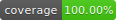

# Compte Rendu TP CI/CD

## Exercice 1 : Configuration de l'environnement local

Installation des différents outils nécessaires pour la CI/CD.

- Docker
- gitlab-runner
- hatch

## Exercice 2 : Configuration du projet

Nom du projet : my-arithmetic-oscarb

### fonction pgcd créée
``` python 
def pgcd(a, b):
    while b != 0:
        a, b = b, a % b
    return a
```

### test de la fonction créée
``` python 
def test_valid_pgcd(self):
    self.assertEqual(34, pgcd(40902, 24140))

def test_invalid_pgcd(self):
    self.assertNotEqual(0, pgcd(40902, 24140))
```


## Exercice 3 : Création d'un projet GitLab

### 3.1 Run automatique des tests 

**Contenu du fichier .gitlab-ci.yml pour le run automatique des tests :**
``` yaml
stages:
  - test

image: python:3.13-alpine

# Étape de test
test:
  stage: test
  script:
    - echo "Hello, $GITLAB_USER_LOGIN!"
    - echo "Running Test"
    - apk add gcc python3-dev musl-dev linux-headers
    - pip install --upgrade pip setuptools hatchling
    - pip install hatch
    - hatch shell
    - hatch test
```


### 3.2 Calcul de la couverture de code et affichage du badge

**Contenu du fichier .gitlab-ci.yml mis à jour ajouter le calcul de la couverture de code et affichage du badge :**
``` yaml
stages:
  - test
  - coverage

image: python:3.13-alpine

# Étape de test
test:
  stage: test
  script:
    - echo "Hello, $GITLAB_USER_LOGIN!"
    - echo "Running Test"
    - apk add gcc python3-dev musl-dev linux-headers
    - pip install --upgrade pip setuptools hatchling
    - pip install hatch
    - hatch shell
    - hatch test

# Étape de couverture
coverage:
  stage: coverage
  script:
    - echo "Collecting Code Coverage"
    - pip install pytest-cov
    - pytest --cov=src.my_arithmetic_oscarb.function --cov-report=xml --cov-report=term-missing
  artifacts:
    expire_in: 1 hour
    reports:
      coverage_report:
        coverage_format: cobertura
        path: coverage.xml
  coverage: '/TOTAL.*? (\d+%)$/'
```

**Ligne ajoutée dans le README.md pour afficher le badge de couverture de code :**
``` markdown
[](https://gitlab.univ-lr.fr/oblais/my-arithmetic-oscarb/-/commits/main)
```

**Rendu final du badge :**


J'ai également testé d'ajouter une deuxieme fonction à mon projet pour voir si la couverture de code se mettait à jour automatiquement. Le test a été concluant.

